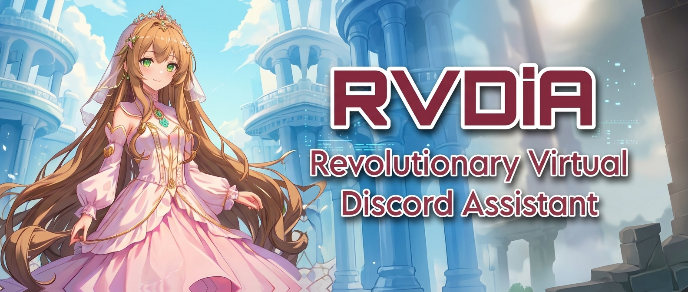
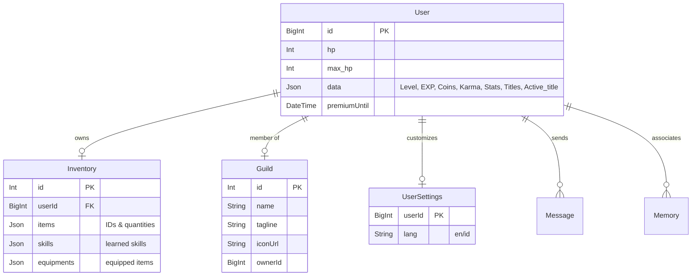
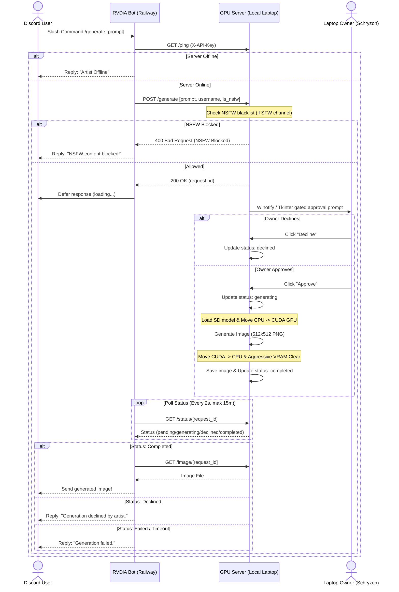

<div align="center">
  
</div>

<p align="center">
  <a href="https://discord.com/api/oauth2/authorize?client_id=957471338577166417&permissions=1514446056561&scope=bot%20applications.commands">
    
  </a>
  <a href="https://discord.gg/QqWCnk6zxw">
    
  </a>
  <a href="https://github.com/sponsors/Schryzon">
    
  </a>
  <a href="https://saweria.co/Schryzon">
    
  </a>
</p>

<p align="center">
  
  
  
  
</p>

<p align ="center">
  <a href="https://top.gg/bot/957471338577166417">
    
  </a>
</p>

---

# 🤖 RVDiA (Revolusioner, Virtual, Independen)

**Revolutionary Virtual Digital Assistant (RVDiA)** is a high-performance, Indonesian-oriented entertainment companion, utility bot, and RPG platform built entirely on a modern Python stack.

### 🔮 Codenamed Adapters
* 🔮 **Discord Bot**: Codenamed **RVDiA Genryu** (源流 - "The Origin/Source"). It acts as the primary coordinator, managing AI interactions, local GPU generation routing, voice clients, and cogs.
* ⚡ **Telegram Bot**: Codenamed **RVDiA Zora** (空 - "Sky"). It serves as a lightweight, database-synced multi-play client running concurrently within the main event loop.

---

## Table of Contents
1. [Core Features](#core-features)
2. [Codebase Directory Structure](#codebase-directory-structure)
3. [Database Schema & Architecture](#database-schema--architecture)
4. [Local GPU Generation Pipeline](#local-gpu-generation-pipeline)
5. [Web Dashboard & REST APIs](#web-dashboard--rest-apis)
6. [Embeddable Web Chat Widget](#embeddable-web-chat-widget)
7. [Local Development Setup](#local-development-setup)
8. [Deployment](#deployment)
9. [Credits & Contributors](#credits--contributors)

---

## Core Features

### ⚔️ Turn-Based RPG Battle Engine (`Re:Volution ~ The Dream World`)
* **Tactical In-Battle Interface**: Features paginated Select Menus (complying with Discord's UI limits) for skills and equipments, complete with real-time health trackers and active state monitoring.
* **Shop & Inventory**: Over **100+ items, skills, and equipments** configured in JSON and dynamically translated based on locale settings.
* **Boss Fights & Elite Tiers**: Challenging bosses with complex phases (e.g., Demi-fiend, Nahobino) and unique mechanisms.
* **Collectible Title Nameplates**: Unique achievements unlocked via boss battles or passive triggers, displayed as custom glowing/rainbow badges on high-resolution player profile cards.
* **Daily Multipliers & Streaks**: Consecutive daily logins build a multiplier bonus (up to +50% rewards). Integrated with Top.gg vote checks to double daily rewards (EXP, Coins, Karma).
* **Co-op World Boss Battles**: Face off against community-wide World Bosses with real-time HP synchronization. Recruit dreamers directly from status screens to send reinforcements calls.

### 🖼️ Advanced Image Processing Toolkit
* **Mathematical Comparison**: Employs OpenCV and Matplotlib to analyze and graph visual histograms side-by-side. Supports multiple metric engines (`correl`, `chisqr`, `intersect`, `bhattacharyya`).
* **Complex Filtering**: Grayscale, color inversion, circular cropping, blurring, sharpening, Edge detection (Canny, Sobel, Laplacian), noise insertion, histogram equalization (CLAHE), embossing, sepia, pixelation, vignette, gamma correction, Fourier domain filters (LPF, HPF, homomorphic), steganography (LSB hide/reveal), and wavelet decomposition.
* **Paginated Navigation**: Built-in interactive Discord UI button components enabling fast Next/Prev searching for internet images directly inside message threads.

### 🧠 Persistent AI Memories
* **Contextual Recall**: Integrates Google Gemini API with [Prisma Client Python](https://prisma-client-py.readthedocs.io/) and vector embeddings to search, record, and write persistent user interactions.
* **Linguistic Title Casing**: Intelligent formatter processing title-casing rules tailored specifically for Indonesian and English grammatical structures.

### 🎵 Robust Voice & Music Engine
* **Gateway E2EE DAVE Support**: Upgraded to `discord.py[voice]>=2.7.1` with the mandatory **DAVE (Discord Audio/Video End-to-End Encryption)** protocol.
* **SoundCloud Fast Search**: Bypasses metadata processing during initial queries using flat extraction (`process=False`), rendering query dropdowns instantly (~0.5s instead of ~10.7s).
* **Lazy Stream Resolution**: Resolves the streaming media URL on-demand right before the track is played in the voice channel.
* **Advanced Player Controls**: Integrated `seek`, `forward`, `rewind`, queue shuffling, loop modes (Off, Repeat One, Repeat All), Spotify track resolution, and surprise genre command (`surprise`).
* **Auto-Disconnect & Idle Cleanups**: Automatically leaves the channel if the bot is left alone with only bots for more than 1 minute, or if the queue is empty for over 5 minutes.

---

## Codebase Directory Structure

```ascii
RVDiA/
├── cogs/                       # Discord Bot Commands and Cogs
│   ├── Conversation.py         # Google GenAI Chat & Vector Memories
│   ├── Image.py                # OpenCV / CuPy Filters & Steganography
│   ├── Music.py                # Music Player (SoundCloud + Fast Search)
│   ├── Game.py                 # Turn-based RPG Battle Engine
│   └── Verification.py         # Verification and Server Gateways
├── locales/                    # Multilingual Dictionaries (en.json / id.json)
├── scripts/                    # Parallel Adapters and Backend Logic
│   ├── api/                    # Web Server, OAuth2, and REST APIs
│   │   ├── web_server.py       # aiohttp Dashboard Entrypoint
│   │   └── routes.py           # Dashboard API Endpoints
│   ├── ai/                     # GPU Server pipelines & Memory managers
│   ├── telegram_bot.py         # Telegram Polling Adapter (Zora)
│   └── main.py                 # Shared database (Prisma) connection
├── website/                    # Static Assets & Web Templates
│   ├── static/                 # CSS styling, local widget JS, images
│   └── templates/              # Jinja2 HTML Layouts (Dashboard, Widget)
├── schema.prisma               # PostgreSQL Database Prisma Schema
├── Dockerfile                  # Production Slim Image Builder
└── RVDIA.py                    # Main Entrypoint / Bot Bootstrapper
```

---

## Database Schema & Architecture

RVDiA relies on PostgreSQL for persistence, mapped via [schema.prisma](file:///c:/Users/nyoma/OneDrive/Desktop/RVDIA/schema.prisma). The core models are organized as follows:



* **Relations Cascading**: Disbanding a guild safely disconnects all user relations in the database. Deleting users cleanly cascade-deletes their related `Inventory` record.

---

## Local GPU Generation Pipeline

To perform heavy Stable Diffusion inference (`Meina/MeinaMix_V11`) without exhausting memory on a low-VRAM development machine (RTX 3050 4GB), RVDiA offloads rendering to a localized laptop server. The process is gated by interactive Windows notification checks to prevent background disruptions:



---

## Web Dashboard & REST APIs

The web interface is hosted on `aiohttp` and `Jinja2` with zero Node dependencies, utilizing standard CSS and clean Javascript logic.

### Authentication
Authentication utilizes a secure Discord OAuth2 authorization flow. Sessions are persisted client-side using HMAC-signed cookies to prevent hijacking.

### Endpoints Definition (in [routes.py](file:///c:/Users/nyoma/OneDrive/Desktop/RVDIA/scripts/api/routes.py))

| Method | Endpoint | Description | Auth Required |
| :--- | :--- | :--- | :---: |
| **GET** | `/api/v1/user/profile` | Fetches authenticated user's profile metadata and currencies. | Yes |
| **GET** | `/api/v1/user/inventory` | Fetches the user's item, skill, and equipment logs. | Yes |
| **GET** | `/api/v1/stats` | System metrics (uptime, CPU/RAM, command executions). | No |
| **POST** | `/api/v1/chat` | Send a prompt to the context-aware chat engine. | Yes |
| **GET** | `/api/v1/shop` | Fetches the translated list of marketplace items, categorized. | Yes |
| **POST** | `/api/v1/shop/buy` | Purchase a shop item (consumable, skill, equipment). | Yes |
| **GET** | `/api/v1/leaderboard` | Fetches Top Players or Guilds ranked rankings. | Yes |
| **GET** | `/api/v1/guild` | Fetches active guild stats, tagline, icon, and member list. | Yes |
| **POST** | `/api/v1/guild/create`| Spawns a guild for 5,000 Coins. | Yes |
| **POST** | `/api/v1/guild/edit` | Modifies the guild name, tagline, or icon URL. | Yes |
| **POST** | `/api/v1/guild/kick` | Kicks a member (only available to the guild owner). | Yes |
| **POST** | `/api/v1/guild/leave` | Leave/disband the guild. | Yes |
| **POST** | `/api/v1/public/chat` | Session-hashed public endpoint for the web widget. | No |

---

## Embeddable Web Chat Widget

RVDiA features an embeddable chat script allowing users to interface with the AI assistant from external web pages.

### Security & Session-Hashing
To avoid polluting the database with arbitrary guest entries, the public endpoint `/api/v1/public/chat` handles stateless traffic by mapping incoming client UUIDs:
1. Client generates a random UUID on their first load and saves it to `localStorage`.
2. The server hashes this string using **SHA-256** and extracts the first 8 bytes.
3. This creates a positive 63-bit signed integer representation which serves as a virtual Discord user ID context in PostgreSQL.
4. Allows persistent, isolated chat threads per web visitor without requiring Discord login credentials.

### Quickstart Embed
Include this script tag inside your HTML body to launch the chatbot:
```html
<script 
  src="http://localhost:8080/static/js/rvdia-widget.js"
  data-api-url="http://localhost:8080" 
  data-lang="id"
  defer>
</script>
```

### Developer Testbed
Creators can visit the built-in development sandbox at `/widget-demo` to inspect the embedded script, configure language settings, and view real-time API logs detailing requests, UUID-to-ID hashes, and response packages.

---

## Local Development Setup

Follow these steps to set up and run RVDiA on a Windows machine.

### Prerequisites
* **PowerShell 5.1+** (or modern PowerShell Core)
* **Python 3.12** (Scoop package manager is recommended: `scoop install python312`)
* **PostgreSQL** database instance.

### Step-by-Step Installation
1. **Clone the repository**:
   ```powershell
   git clone https://github.com/Schryzon/RVDiA.git
   cd RVDiA
   ```

2. **Configure Environment Variables**:
   Copy `.env.example` to `.env` and fill out your api credentials, discord developer credentials, and local postgres database link:
   ```powershell
   copy .env.example .env
   ```

3. **Install Requirements**:
   ```powershell
   pip install -r requirements.txt
   ```

4. **Initialize Prisma Client**:
   Generate database abstractions and sync models:
   ```powershell
   # Generate schema bindings
   prisma generate
   
   # Synchronize models to Postgres
   prisma db push --accept-data-loss
   ```

5. **Launch the Engine**:
   Run the main bot and web panel:
   ```powershell
   python RVDIA.py
   ```
   The dashboard will be active at `http://localhost:8080`.

---

## Deployment

RVDiA is configured for seamless deployment on **Railway** using the provided [Dockerfile](file:///c:/Users/nyoma/OneDrive/Desktop/RVDIA/Dockerfile) and [railway.toml](file:///c:/Users/nyoma/OneDrive/Desktop/RVDIA/railway.toml).

When launching in a production container, [start.sh](file:///c:/Users/nyoma/OneDrive/Desktop/RVDIA/start.sh) runs automatically, ensuring the prisma database models are pushed and client headers are rebuilt before spawning `RVDIA.py`.

---

## Credits & Contributors

### Special Acknowledgments
* **Concept Inspiration**: Riverdia.
* **Advisors & Core Testers**: iMaze, Mouchi, Dez, Zenchew, Ismita, Pockii, Kyuu, Kazama, Bcntt, Nateflakes, nathawiguna, opensourze, Shiruto, Satya Yoga.

---

**Made with ❤️ and dedication by Jayananda and contributors.**

*Rebirth: 30/04/2026*