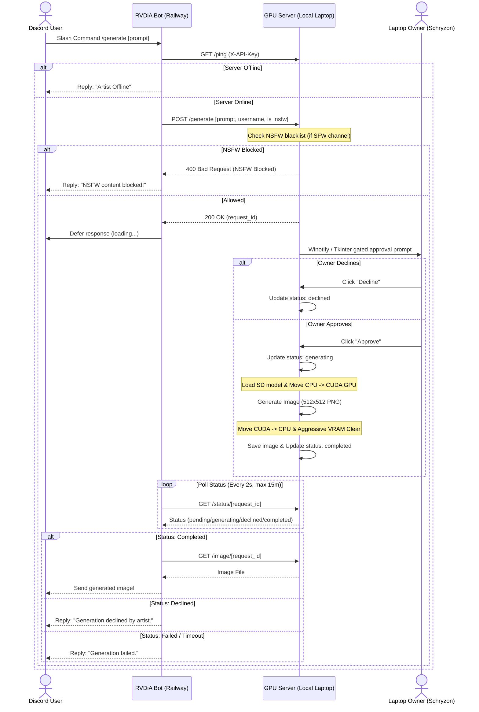

  

  
  
  
  

  
  
  
  

  

# RVDiA
## "Revolusioner, Virtual, Independen."
Revolutionary Virtual Discord Assistant (RVDiA) is an **Indonesian-oriented Fun Bot focused on Games and Image Processing**.

## What's Special About This Bot?
This bot is in Indonesian and has special commands for members of the G-Tech Re'sman club. It also offers a variety of utilities, its own RPG (role-playing game) system, and a **dynamic web dashboard**.

## Core Features & Recent Updates
- **RPG Battle System**: A deep, turn-based combat system with levels, stats, and skills.
    - **Massive Content**: Over **100+ items and skills** available in the paginated Shop.
    - **Elite Challenges**: New **FINAL BOSS** tier featuring multi-phase threats like Demi-fiend and Nahobino.
    - **Tactical UI**: Enhanced in-battle UI with real-time stat checking and **Select Menu optimizations** (paginated items/skills) to comply with Discord API limits.
- **Advanced Image Analysis**: Professional-grade image processing toolkit powered by OpenCV and Matplotlib.
    - **Visual Histogram Comparison**: Compare two images with mathematical precision (`correl`, `chisqr`, etc.) and receive a **side-by-side visual plot**.
    - **Paginated Image Lookup**: Search for images directly in Discord with an interactive navigation system (Next/Prev buttons).
- **AI Memory & Logic**: Persistent personality driven by Google Gemini and Prisma.
    - **Smart Memory**: Efficient memory management using Prisma with optimized query logic.
    - **Smart Title Casing**: Intelligent text formatting handler that respects linguistic rules for both Indonesian and English.
- **Dynamic Web Dashboard**: Built with `aiohttp` and `Jinja2` featuring premium Glassmorphism aesthetics, responsive layouts, and multilingual support (ID/EN).
    - **Secure OAuth2 Auth**: Complete authentication flow with Discord, utilizing HMAC-signed cookies for secure session storage.
    - **REST API Endpoints**:
        - `/api/v1/user/profile` — Fetches authenticated user profile and details.
        - `/api/v1/user/inventory` — Retrieves the user's RPG inventory.
        - `/api/v1/stats` — Exposes system statistics and command execution metrics.
        - `/api/v1/chat` — Connects the web client to the backend chat service.
    - **Interactive Frontend**: Rich client-side dashboard with real-time stats updates, animated numeric counters, and a fully functional live chat console.
- **Top.gg API Integration**: Built-in automated server and shard status reporting using the latest Top.gg API v1 batch metrics endpoint.

## Gated Local GPU Image Generation Pipeline
To run Stable Diffusion (`Meina/MeinaMix_V11`) on a low-VRAM laptop (e.g. RTX 3050 4GB) without interrupting web browsing, RVDiA offloads image generation to a local server gated by interactive Windows notification prompts.

## Want to Tinker with It Yourself?
1. Clone this repo or download the latest release from tags;
2. Get a Discord bot token & Top.gg token;
3. Get a PostgreSQL Database URL (`DATABASE_URL`) for Prisma;
4. Get an OpenWeather API key, OpenAI key (for DALL-E), and Google Gemini API key (`googlekey`).
* There might be more necessities.

(For the `.env` format, check out `.env.example`. Remember to keep your bot secure!)

## Additional Information
This project is __just for fun__ and to improve my programming skills regarding virtual bots and web apps.

Currently, RVDiA is configured to be hosted using **Railway via Docker**. So, if you want to run the bot, I recommend using Railway's services. But, if you just want to run the bot locally on your personal computer, that's no problem.

Run `./start.sh` (or deploy via Docker) to start the bot. This script will automatically generate the Prisma client, push the database schema, and run both RVDiA and the Xelvie monitor. The web dashboard will be accessible at `http://localhost:8080` (or the configured `PORT`).

Join the [CyroN Central server](https://discord.gg/QqWCnk6zxw) on Discord and contact me (Schryzon) if you have any issues, questions, or want to collaborate on RVDiA's development.

### Credits
Special thanks to Riverdia (for inspiring the bot's name), iMaze, Mouchi, Dez, Zenchew, Ismita, Pockii, Kyuu, Kazama, Bcntt, Nateflakes, nathawiguna, opensourze, Shiruto, Satya Yoga, and many more for helping me with previous projects!

**Made with ❤️ and dedication, Jayananda and contributors**

## Community
- [Contributing Guidelines](CONTRIBUTING.md)
- [Code of Conduct](CODE_OF_CONDUCT.md)

---

Farewell, Yuyuko, Pandora, and Historia. You will be missed.

`Verified: 01/08/2023`

`End of Life: 08/04/2025`

`Rebirth: 30/04/2026`